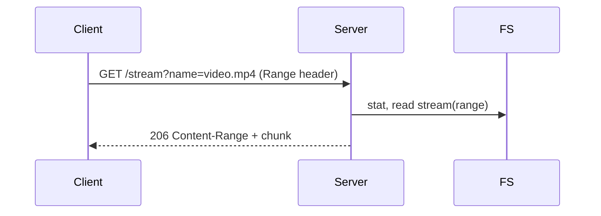
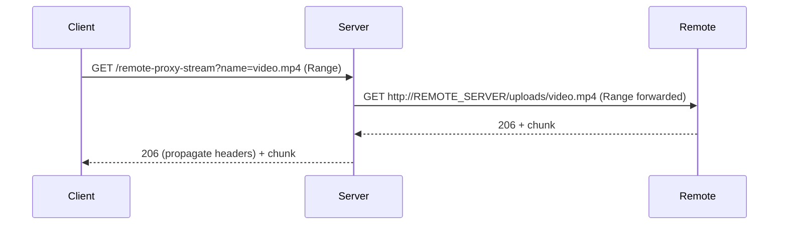

# servers-os

Documentación completa — servers-os

Servidor(s) de ejemplo en Node.js que exponen una API REST para gestionar archivos locales (CRUD), sirven una interfaz web responsiva en `public/`, soportan streaming de vídeo (Range), subida múltiple con control de concurrencia y ofrecen endpoints proxy para acceder a archivos de un servidor remoto.

Contenido del repositorio
- `ubuntu-server.js` — servidor principal: endpoints CRUD, streaming (`/stream`), proxy remoto (`/remote-proxy`, `/remote-proxy-download`, `/remote-proxy-stream`), subida (`/upload`) y monitor (`/stats`).
- `windows-server.js` — espejo del anterior (misma funcionalidad, distinto REMOTE_SERVER por defecto).
- `public/` — UI estática: `index.html`, `app.js`, `styles.css`.
- `uploads/` — carpeta donde se guardan los archivos subidos (creada en tiempo de ejecución).
- `package.json` — manifiesto y scripts (`start-ubuntu`, `start-windows`, `start`).

Requisitos
- Node.js >= 14
- npm

Instalación (Windows PowerShell)

```powershell
cd "c:\Users\lopez\Downloads\servers-os"
npm install
```

Arrancar el servidor (ejemplo ubuntu)

```powershell
npm run start-ubuntu
# o
npm start
```

Si quieres ejecutar el otro servidor en otra máquina/VM, edita la constante `REMOTE_SERVER` dentro del archivo correspondiente (`ubuntu-server.js` o `windows-server.js`) y ejecuta `npm run start-windows` en esa otra máquina.

Uso en el navegador
- Accede a: http://localhost:8080/
- Desde la UI puedes: subir archivos (múltiples), listar archivos locales y remotos, ver imágenes/videos, descargar, renombrar y eliminar archivos.

Resumen de endpoints

Base URL: http://<host>:8080

1) GET /
- Sirve `public/index.html`.

2) GET /files
- Lista nombres de archivos locales (JSON array).
- Respuesta 200: ["a.png","video.mp4"]

3) GET /files/:name
- Devuelve el archivo solicitado. Si se añade `?download=1` fuerza la descarga (attachment).
- 404 si no existe.

4) GET /stream?name=<name>
- Streaming con soporte `Range` (recomendado para reproducción de vídeo y seek en el navegador).
- Si el header `Range` viene presente se responde 206 con `Content-Range`.

5) GET /remote-proxy
- Consulta el `REMOTE_SERVER` configurado y devuelve la lista de archivos remotos en formato `{ name, url }`.

6) GET /remote-proxy-download?name=<name>
- Proxy que reenvía la descarga del archivo remoto y fuerza `Content-Disposition: attachment`.

7) GET /remote-proxy-stream?name=<name>
- Proxy de streaming: reenvía el header `Range` a remoto para permitir reproducción remota y seek.

8) POST /upload
- Subida de archivos multipart. El servidor acepta múltiples archivos.
- El cliente debe enviar FormData con `files` (ej.: `fd.append('files', file)` repetido). El servidor usa `upload.any()` para aceptar cualquier nombre de campo.
- Respuesta JSON: `{ ok: true, files: ["name1","name2"] }` o redirect a `/` si es petición desde formulario.

9) PUT /files/:name
- Renombra un archivo. En el body JSON: `{ "newName": "nuevoNombre" }`.

10) DELETE /files/:name
- Elimina un archivo local.

11) GET /stats
- Devuelve métricas internas: uptime, currentUploads, locks, filesStored, memory, load, platform.

Formato de error
- Errores de Multer se devuelven como JSON con `{ error: 'MulterError', code: '...', message: '...' }`.

Arquitectura y decisiones clave

- Servidor HTTP: Express. Manejo de multipart: Multer. Proxy HTTP: Axios.
- Storage local: `uploads/` en el filesystem del host.
- Concurrency control (subida):
	- Semáforo (variable `currentUploads` con `MAX_CONCURRENT_UPLOADS` por defecto 3) para limitar workers simultáneos.
	- Locks por nombre (`nameLocks` Set) adquiridos en orden determinista (orden lexicográfico) para evitar deadlocks al procesar múltiples archivos con nombres potencialmente iguales. El algoritmo se inspira en Dining Philosophers (evitar circular wait mediante orden global).
	- Los locks y el semáforo son in-memory: funcionan solo dentro del mismo proceso Node. En entornos con múltiples instancias usar un lock distribuido (Redis/RedLock) o colas.

- Streaming: `/stream` implementa soporte `Range` y `Content-Range` para entregar fragmentos de archivos (respuestas 206 cuando procede). `/remote-proxy-stream` reenvía el header `Range` al servidor remoto y propaga su respuesta al cliente.

Diagrama de flujo (Mermaid)

Subida (simplificado):

```mermaid
sequenceDiagram
	participant Client
	participant Server
	participant FS
	Client->>Server: POST /upload (multipart files)
	Server->>Server: acquireUploadSlot() (semaphore)
	Server->>Server: acquireLocks(sorted(unique(names)))
	Server->>FS: move temp files -> uploads/<name>
	Server->>Server: releaseLocks(); releaseUploadSlot()
	Server-->>Client: 200 JSON {ok:true, files:[...]}
```

Streaming local:



Proxy streaming remoto:



Ejemplos prácticos (curl & PowerShell)

- Listar archivos (curl):

```bash
curl -s http://localhost:8080/files | jq .
```

- Descargar archivo (forzar descarga):

```bash
curl -O -J "http://localhost:8080/files/myfile.txt?download=1"
```

- Subir varios archivos (curl):

```bash
curl -F "files=@/path/to/foo.png" -F "files=@/path/to/bar.mp4" http://localhost:8080/upload
```

- Subir desde PowerShell:

```powershell
#$files = @("C:\path\to\a.png","C:\path\to\b.mp4")
#$form = [System.Net.Http.MultipartFormDataContent]::new()
#foreach ($f in $files) { $form.Add([System.Net.Http.StreamContent]::new([System.IO.File]::OpenRead($f)), 'files', [System.IO.Path]::GetFileName($f)) }
#$client = [System.Net.Http.HttpClient]::new()
#$r = $client.PostAsync('http://localhost:8080/upload', $form).Result
#$r.Content.ReadAsStringAsync().Result
```

Nota: El ejemplo de PowerShell está comentado porque PowerShell requiere un poco más de código para crear MultipartFormDataContent.

UI (public/)
- `index.html` contiene el formulario (`#uploadForm`), input file con `name="files"` y `multiple`, y dos paneles: `#localList` y `#remoteList`.
- `app.js`:
	- `loadLocal()` llama a GET /files y renderiza cada archivo con botones: Ver (si es imagen/video), Descargar, Renombrar, Borrar.
	- `loadRemote()` usa GET /remote-proxy y muestra archivos remotos; Ver remoto usa `/remote-proxy-stream`.
	- Modal multimedia reusa elementos `<video>` y `` para ver medios en ventana modal.

Monitor/telemetría
- `renderDashboard()` imprime en consola cada segundo un resumen: uptime, uploads activos, locks, cantidad de archivos y últimos eventos (buffer `recentEvents`).
- Endpoint `/stats` devuelve las mismas métricas en JSON para integraciones.

Pruebas sugeridas (smoke tests)
1. GET /files → comprobar JSON.
2. Subir 1 imagen → debe aparecer en la lista local y poder verse en modal.
3. Subir varios archivos con nombres repetidos → comprobar que los nuevos archivos reciben sufijos timestamp y que no se pisan.
4. Reproducir vídeo y hacer seek → cliente debe recibir 206 de streaming.
5. Probar proxy remoto: configurar `REMOTE_SERVER` y verificar listado remoto y reproducción remota.

Seguridad y recomendaciones (priorizadas)
1. Validar tipos y tamaños de archivo con Multer (`limits` y `fileFilter`).
2. Añadir autenticación/autorización para los endpoints sensibles (subida, renombrar, borrar).
3. Reemplazar locks in-memory por Redis/RedLock para entornos con múltiples instancias.
4. Usar un logger estructurado (p. ej. pino o winston) y exponer métricas Prometheus.
5. Servir detrás de un reverse-proxy (nginx) con TLS en producción.

Docker (sugerencia básica)
Puedes crear un `Dockerfile` que exponga 8080 y monte un volumen para `uploads/`.

Ejemplo mínimo `Dockerfile`:

```Dockerfile
FROM node:18-slim
WORKDIR /app
COPY package*.json ./
RUN npm ci --only=production
COPY . .
EXPOSE 8080
CMD ["node","ubuntu-server.js"]
```

Limitaciones actuales
- `upload.any()` se usa para evitar MulterError "Unexpected field" — esto es flexible pero menos estricto. Si quieres validar que el campo se llama `files`, cambia a `upload.array('files')` y ajusta el cliente.
- Los locks/semáforo son in-memory (no sirven entre procesos/hosts).
- El README y la UI están en español; si deseas traducción o i18n lo puedo añadir.

Próximos pasos que puedo implementar ahora
- Añadir un `Dockerfile` y `docker-compose.yml` para pruebas locales.
- Añadir tests automáticos (Jest + Supertest) para endpoints CRUD y upload.
- Añadir validación Multer (size/type limits) y mensajes de error más claros.
- Añadir autenticación básica (HTTP Basic o JWT).

Si quieres que actualice el `README.md` para incluir ejemplos curl más detallados, o que genere el `Dockerfile` y tests, dime cuál de las tareas prefieres y la hago a continuación.
